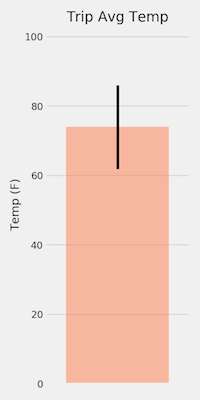
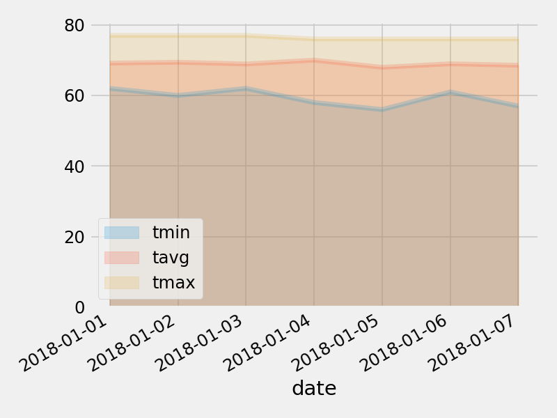

# Surfs Up!

- Climate Analysis and Exploration

Used Python and SQLAlchemy to doclimate analysis and data exploration of the climate database. 

Tools: SQLAlchemy ORM queries, Pandas, and Matplotlib.

### Precipitation Analysis

  

### Station Analysis
    

### Temperature Analysis II

    

### Daily Rainfall Average

  

